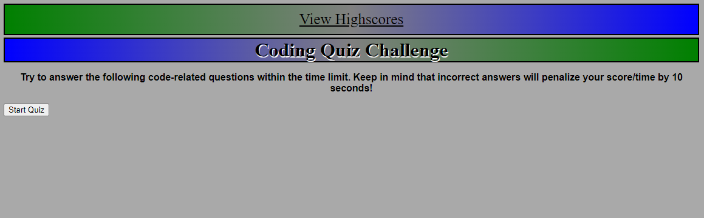

# Test-Your-Knowledge

## Purpose of this challenge
This was a particularly challenging assignment. I got exposed to using many moving parts including multiple .js files and interlinking them to create this webpage. 
I also got to dynamically create elements, and index information into them. Finally I had work with storing, and retrieving data from the local storage to display highscores and initials. Overall it was a big step in getting my feet wet using javaScript.

## Image of webpage
 

## Deployment link

https://dav3ster.github.io/Test-Your-Knowledge/
